Argentinean League Football Analysis (2016-2022)
================

### Import libraries

``` r
library(ggplot2)
library(readxl)
library(dplyr)
library(readr)
library(viridis)
library(skellam)
library(formatR)

pathBase = dirname(rstudioapi::getSourceEditorContext()$path)
partidos <- read_csv(paste0(pathBase,"/partidos.csv"))
```

### Aesthethic variables

``` r
colores = c(
    '2016-2017' ='yellow',
    '2017-2018' = "green",
    '2018-2019' = "orange",
    '2019-2020' = 'pink',
    '2021' = 'magenta',
    '2022' = "red")

fuentes_customizadas = list( theme(
                text = element_text(size=14, color = "black"),
                axis.text.x = element_text(face="plain",size = 11, color="black"),
                axis.text.y = element_text(face="plain", size = 11, color="black"),
                plot.title = element_text(size = 12, face = "bold"),
                legend.position = "none",
                legend.key.size = unit(0.5, 'cm'),
                panel.grid.major = element_blank(), 
                panel.grid.minor = element_blank(),
                panel.background = element_blank(), 
                axis.line = element_line(colour = "black")), 
                labs(fill = ""))
```

# **EDA: SEASON-WISE ANALYSIS**

The first thing to evaluate is how many goals were scored per season. We
can conclude from this simple analysis that the 2016-17 season had the
highest number of goals scored while the 2019-20 (probably due to the
suspension of lots of matches due to the COVID-19 pandemic) was the
poorest one.

## 1.- Total goals per season

``` r
#-------------------
# Data processing
#-------------------
partidos <- na.omit(partidos)
partidos$goles_total = partidos$local_goles + partidos$visitante_goles

goles_tot = partidos %>%
    group_by(temporada) %>%
    dplyr::summarise(n_goles_total = sum(goles_total))
```

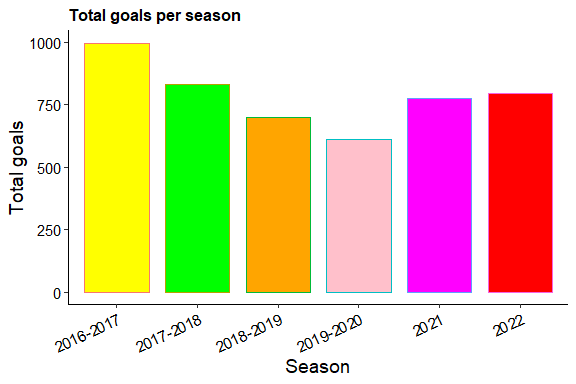

## 2.- Goals per season - Home vs Away

The following back-to-back plot allows a comparison per season of the
number of goals scored by the home and away teams. At a qualitatively
level, we can see that the home team tends to score more goals that the
away team.

``` r
#-------------------
# Data processing
#-------------------
goles_local = partidos %>%
    group_by(temporada) %>%
    dplyr::summarise(n_goles_local = sum(local_goles))

goles_visitante = partidos %>%
    group_by(temporada) %>%
    dplyr::summarise(n_goles_visitante = sum(visitante_goles))

goles = merge(goles_local, goles_visitante, by = "temporada")
goles$temporada = as.factor(goles$temporada)

goles_long = reshape2::melt(goles, value.name = "nro_goles", variable.name = "localia",
    id.vars = c("temporada"))
goles_df = goles_long %>%
    mutate(nro_goles = ifelse(localia == "n_goles_visitante", -nro_goles, nro_goles))

temp_df <- goles_df %>%
    filter(localia == "local") %>%
    arrange(nro_goles)

the_order <- temp_df$temporada
```

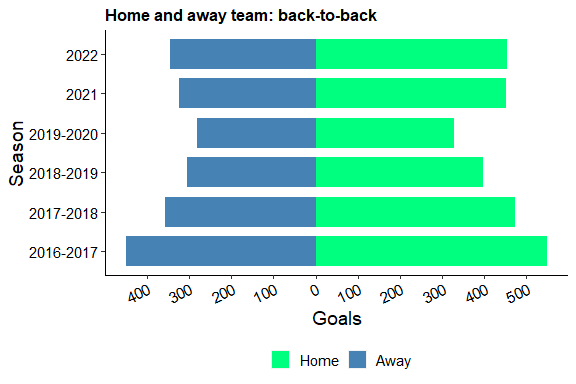

## 3.- Heatmap: goals per week of the season

This heat map shows the number of goals scored by match week per season.
We may get several insights from it. \* The last match week in the last
two seasons showed a whooping number of goals scored in comparison to
the rest of the seasons. \* Because of different formats applied to the
Argentinean league, the length of the season was never kept constant. \*
The 2019-20 season was, definitively, the shortest due to the pandemic.

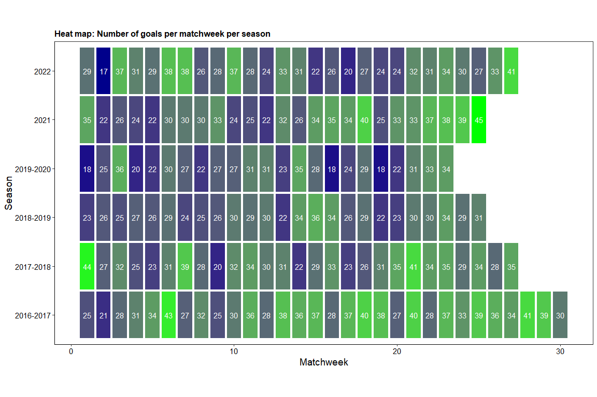

## 4.- Heatmap: goals per match of the season

This heat map shows the average number of goals scored per match, by
match week per season. With these values we can see what is the expected
(I use this term as the average, indistinctly) number of goals per
match.

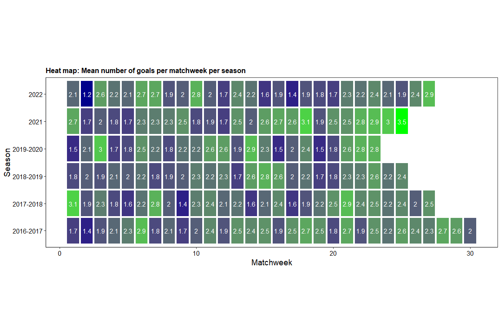

## 5.- Goals scored as a function of the result of the match

How many goals are scored by the teams, season wise, when the winner was
the home team, the away team or the match resulted in a tie? Usually,
the host team scores more goals than the away one.

``` r
#-------------------
#   Data processing
#-------------------
localia = partidos %>% 
    group_by(temporada, resultado) %>%
    dplyr::summarise(total_count=n())

localia$resultado <- factor(localia$resultado,
                            levels=c('local', 'empate','visitante'))
```

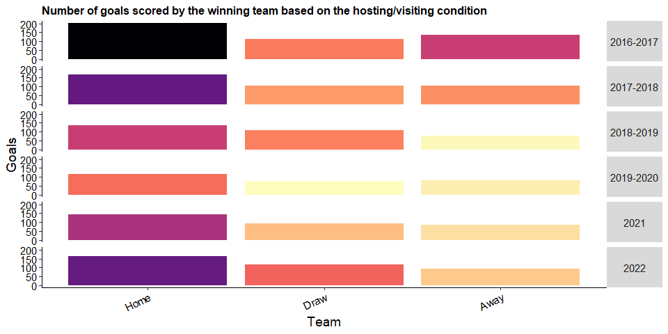

# **EDA: CLUB-WISE ANALYSIS**

## 1.- Goals per team

The following plot depicts the number of goals scored by team and by
season:

- Boca Juniors, Racing Club and River Plate seem to be the teams that
  score the most, throughout the seasons analyzed.
- There are teams missing in some seasons due to relegation (which, as
  the number of matches per season, constantly changed in this league
  during this period)

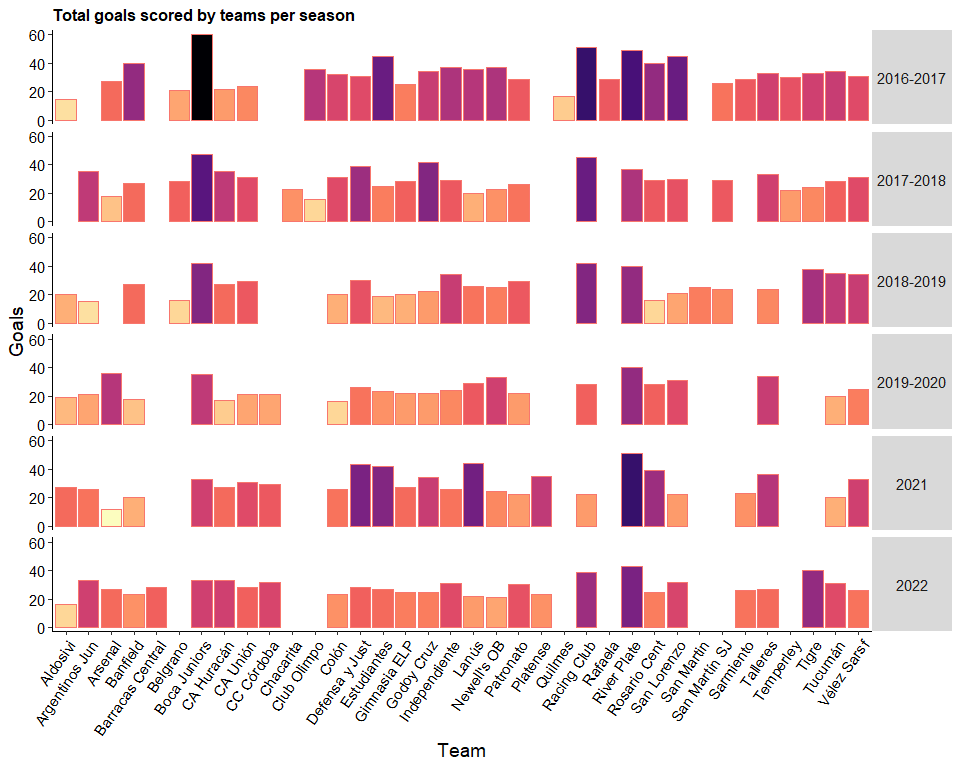

## 2.- Cards per team

Are there teams that are booked more than others?

``` r
#-------------------
#   Data processing
#-------------------

tarjetas_local = partidos %>%  group_by(temporada, local) %>% 
    dplyr::summarise(amarillas = sum(local_amarillas),
              rojas = sum(local_rojas))
colnames(tarjetas_local)[which(names(tarjetas_local) == 'local')] <- 'equipo'

tarjetas_visitante = partidos %>%  group_by(temporada, visitante) %>% 
    dplyr::summarise(amarillas = sum(visitante_amarillas),
              rojas = sum(visitante_rojas))
colnames(tarjetas_visitante)[which(names(tarjetas_visitante) == 'visitante')] <- 'equipo'

tarj = merge(x=tarjetas_local, y=tarjetas_visitante, by=c('temporada', 'equipo'))
tarj$equipo = as.factor(tarj$equipo)
tarj$amarillas = tarj$amarillas.x + tarj$amarillas.y
tarj$rojas = tarj$rojas.x + tarj$rojas.y
```

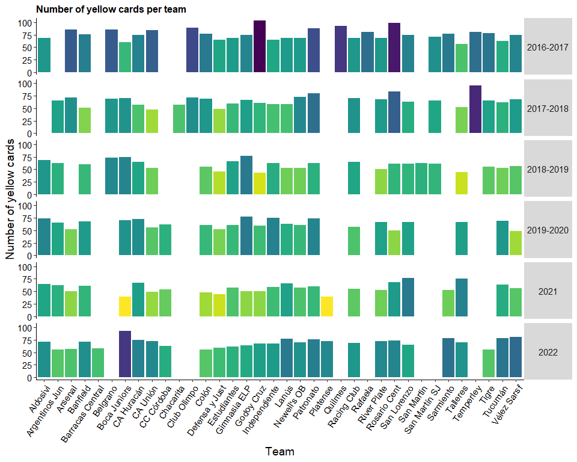

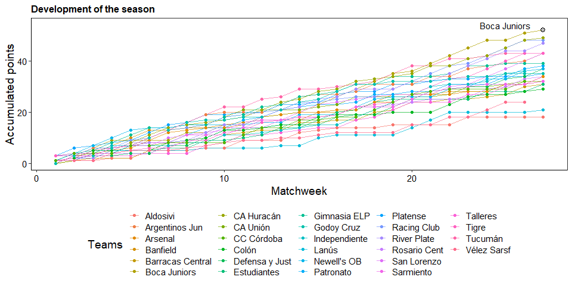

## 3.- Referee’s cards performance

Are there more/less strict referees in terms of bookings?

``` r
#-------------------
#   Data processing
#-------------------
arbitros = partidos %>% group_by(temporada, arbitro) %>%  
    dplyr::summarise(ama_al_local = sum(local_amarillas),
              ama_al_visitante = sum(visitante_amarillas),
              roja_al_local = sum(local_rojas),
              roja_al_visitante = sum(visitante_rojas))

arbitros$amarillas_totales = arbitros$ama_al_local + arbitros$ama_al_visitante
arbitros$rojas_totales = arbitros$roja_al_local + arbitros$roja_al_visitante

ama_df <-arbitros %>% arrange(amarillas_totales)

roja_df <- arbitros %>%  arrange(rojas_totales)
```

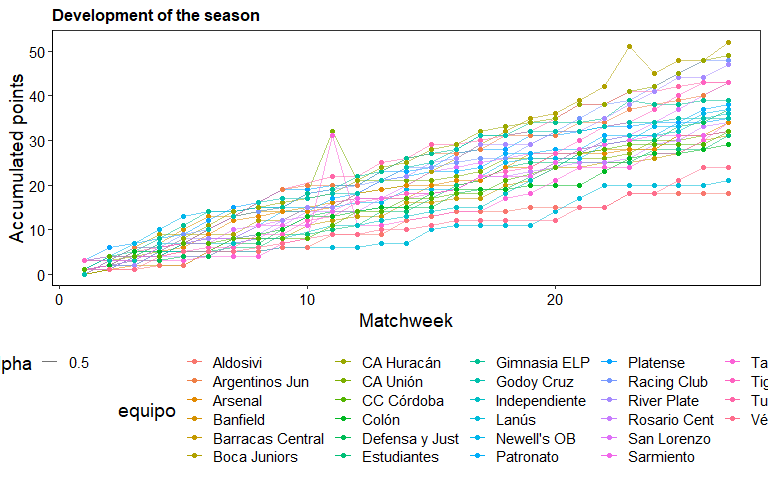

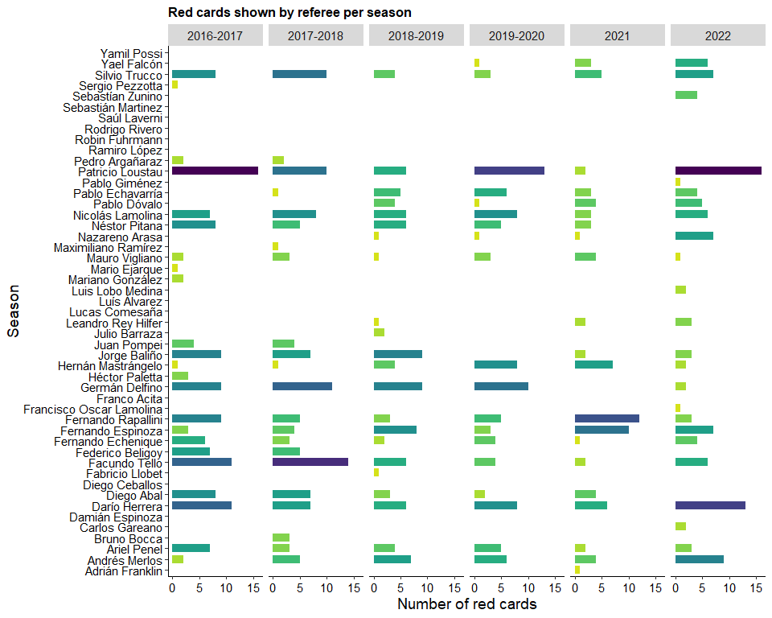

# **PREDICTING RESULTS BY STATISTICAL MODELLING**

We’re going to use the last season available for the most updated data.
To performe predictions, we’ll apply the most basic distribution for
discrete numbers (number of goals), that is, the Poisson distribution.

Such distribution assumes:

- The probability of an event occurring in a given time interval does
  not vary with time
- The events occur at random
- The events occur independently

This distribution has only one parameter, lambda, which is the average
number events per period of time. In terms of our study case, lambda
will represent the average number of goals scored per 90-min match.

``` r
#-------------------
#   Data processing
#-------------------
data = partidos %>% filter(temporada == '2022')
data = data[c('local', 'visitante', 'semana', 'local_goles', 'visitante_goles')]
HOME.AVG = mean(data$local_goles) 
AWAY.AVG = mean(data$visitante_goles)
```

We can directly calculate the average number of goals in the desired
season, so that the home team scores in average 1.2 while the away team
scores 0.91

## 1.- Number of goals per match (observed vs. expected)

The plot below shows the proportion of matches where goals were scored
by the home and the away team (observed, bars), while also showing the
estimated by the corresponding Poisson distributions using thee average
goals as before (estimated, lines).

- From the observed distributions, the away team seem to have a much
  higher proportion of matches without scoring any goals, and that
  number is greater than for the home team.
- For scoring one goal, the proportion is similar, while the trend shows
  a much higher proportion of matches where the home team scored 2 to 5
  goals in comparison with the away team.
- The fitted model does not seem to deviate greatly from the actual seen
  numbers.

``` r
#-------------------
#   Data processing
#-------------------
data_temp = reshape2::melt(data, direction = 'long',
                          value.name = 'equipo',
                          variable.name = "condicion",
                          id.vars=c("semana", "local_goles", 'visitante_goles')) 

data_temp_local = data_temp %>% filter(condicion =='local')
data_temp_local = data_temp_local[,c("semana", 'local_goles','condicion','equipo' )]
colnames(data_temp_local)[which(names(data_temp_local) == 'local_goles')] <- 'n_goles'

data_temp_vis = data_temp %>% filter(condicion =='visitante')
data_temp_vis = data_temp_vis[,c("semana", 'visitante_goles','condicion','equipo' )]
colnames(data_temp_vis)[which(names(data_temp_vis) == 'visitante_goles')] <- 'n_goles'

data_long = rbind(data_temp_local, data_temp_vis)

prop_obs_local = data_long %>% 
    filter(condicion=='local') %>% 
    group_by(n_goles) %>% 
   dplyr::summarise(prop_goles=n()/nrow(.))  
prop_obs_local$observacion = 'observada'
prop_obs_local$condicion = 'local'

prop_obs_vis = data_long %>% 
    filter(condicion=='visitante') %>% 
    group_by(n_goles) %>% 
    dplyr::summarise(prop_goles=n()/nrow(.))  
prop_obs_vis$observacion = 'observada'
prop_obs_vis$condicion = 'visitante'

dpois_obs = rbind(prop_obs_local, prop_obs_vis)

prop_est_local = data.frame(
    prop_goles = dpois(0:max(data_long$n_goles),mean(data$local_goles)),
    n_goles = seq(0,max(data_long$n_goles, by=1)))
prop_est_local$observacion = 'estimada'
prop_est_local$condicion = 'local'

prop_est_vis = data.frame(
    prop_goles = dpois(0:max(data_long$n_goles), mean(data$visitante_goles)),
    n_goles = seq(0,max(data_long$n_goles, by=1)))
prop_est_vis$observacion = 'estimada'
prop_est_vis$condicion = 'visitante'

dpois_est = rbind(prop_est_local, prop_est_vis)

specific.val = ppois(q=1, lambda= mean(data$local_goles), lower.tail=FALSE)
```

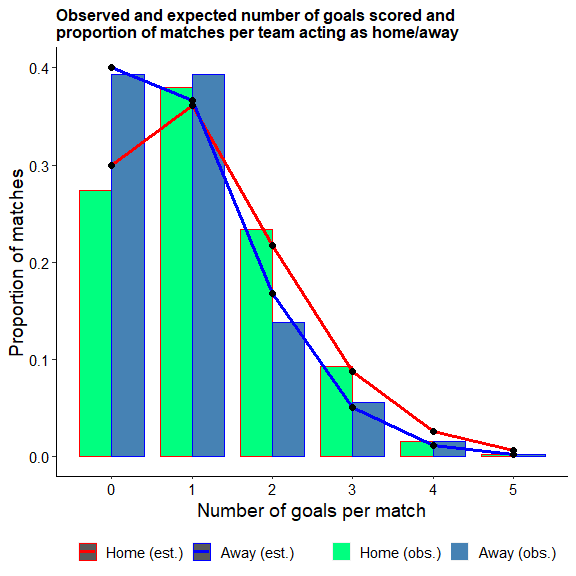

We can go a step further with the simple Poisson model, estimating the
probability of specific events. For example, what is the probability of
the h ome team scoring 2 or more goals? we’re asking for
$P( \ge 2 | Home)$, which is 0.3391023.

## 2.- Difference goal result: Skellam distribution + most probable scenarios

What about draws? for this, we need to know when the difference between
the home and away team Poisson distributions is 0. The distribution that
results from substracting one Poisson from is called a Skellam
distribution.

``` r
#-------------------
#   Data processing
#-------------------
data$gol_diff = data$local_goles - data$visitante_goles 

diff_gol = data %>% group_by(gol_diff) %>%
    dplyr::summarize(prop_goles_obs=n()/nrow(.)) %>%
     inner_join(data.frame(gol_diff=-4:5,
                prop_goles_estimado=skellam::dskellam(-4:5,mean(data$local_goles),
                mean(data$visitante_goles))),by=c("gol_diff"))
```

    ## <ScaleContinuousPosition>
    ##  Range:  
    ##  Limits:    0 --    1

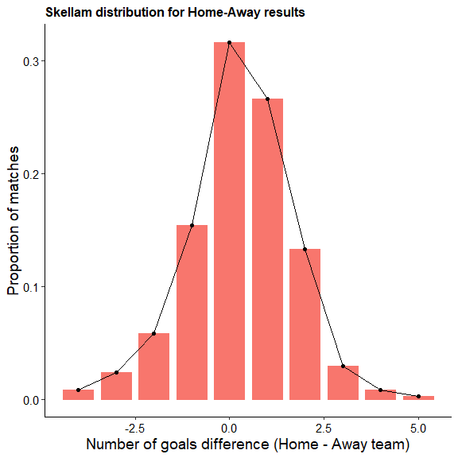

## 3.- Build a model

Finally, lets build a GLM model with which we can make some specific
analysis on the participating teams.

``` r
#-------------------
#   Data processing
#-------------------
df_model =  rbind(
            data.frame(n_goles = partidos$local_goles,
                       equipo = partidos$local,
                       oponente = partidos$visitante,
                       localia = 1),
            data.frame(n_goles = partidos$visitante_goles,
                       equipo = partidos$visitante,
                       oponente = partidos$local,
                       localia = 0))
 
poi_model = glm(n_goles ~ equipo + oponente + localia,
                family=poisson(link=log),data=df_model)
```

``` r
nPartidos = partidos %>%
    filter(temporada=='2022') %>%
    dplyr::summarise(nPartidos = max(semana))
```

Note that if we apply this model to a small sample size (lets say when
the season is going through the 8th matchweek, where each team in the
season would’ve played 27 matches), the accuracy of this approximation
can vary significantly.

    ## 
    ## Call:
    ## glm(formula = n_goles ~ equipo + oponente + localia, family = poisson(link = log), 
    ##     data = df_model)
    ## 
    ## Coefficients:
    ##                          Estimate Std. Error z value Pr(>|z|)    
    ## (Intercept)              -0.18807    0.12758  -1.474 0.140445    
    ## equipoArgentinos Jun      0.30402    0.13426   2.264 0.023552 *  
    ## equipoArsenal             0.18784    0.13664   1.375 0.169234    
    ## equipoBanfield            0.26381    0.12955   2.036 0.041711 *  
    ## equipoBarracas Central    0.31736    0.21465   1.479 0.139273    
    ## equipoBelgrano            0.03311    0.16045   0.206 0.836513    
    ## equipoBoca Juniors        0.73412    0.11971   6.133 8.65e-10 ***
    ## equipoCA Huracán          0.30407    0.12861   2.364 0.018067 *  
    ## equipoCA Unión            0.32495    0.12818   2.535 0.011243 *  
    ## equipoCC Córdoba          0.40055    0.15017   2.667 0.007649 ** 
    ## equipoChacarita           0.12483    0.23210   0.538 0.590713    
    ## equipoClub Olimpo         0.17855    0.17214   1.037 0.299638    
    ## equipoColón               0.22228    0.13072   1.700 0.089058 .  
    ## equipoDefensa y Just      0.50324    0.12413   4.054 5.03e-05 ***
    ## equipoEstudiantes         0.42257    0.12592   3.356 0.000791 ***
    ## equipoGimnasia ELP        0.21697    0.13089   1.658 0.097407 .  
    ## equipoGodoy Cruz          0.41603    0.12618   3.297 0.000976 ***
    ## equipoIndependiente       0.43344    0.12591   3.442 0.000577 ***
    ## equipoLanús               0.41103    0.12642   3.251 0.001149 ** 
    ## equipoNewell's OB         0.31287    0.12832   2.438 0.014762 *  
    ## equipoPatronato           0.29229    0.12908   2.264 0.023548 *  
    ## equipoPlatense            0.39547    0.16614   2.380 0.017296 *  
    ## equipoQuilmes            -0.30630    0.26311  -1.164 0.244362    
    ## equipoRacing Club         0.64753    0.12139   5.334 9.60e-08 ***
    ## equipoRafaela             0.21750    0.21190   1.026 0.304704    
    ## equipoRiver Plate         0.77969    0.11906   6.549 5.81e-11 ***
    ## equipoRosario Cent        0.40610    0.12642   3.212 0.001317 ** 
    ## equipoSan Lorenzo         0.42331    0.12592   3.362 0.000775 ***
    ## equipoSan Martin          0.30629    0.22448   1.364 0.172421    
    ## equipoSan Martín SJ       0.24471    0.15171   1.613 0.106737    
    ## equipoSarmiento           0.22968    0.15218   1.509 0.131234    
    ## equipoTalleres            0.45373    0.12521   3.624 0.000290 ***
    ## equipoTemperley           0.17506    0.17205   1.017 0.308923    
    ## equipoTigre               0.49915    0.13321   3.747 0.000179 ***
    ## equipoTucumán             0.35517    0.12761   2.783 0.005384 ** 
    ## equipoVélez Sarsf         0.42430    0.12605   3.366 0.000762 ***
    ## oponenteArgentinos Jun   -0.38751    0.11724  -3.305 0.000949 ***
    ## oponenteArsenal          -0.05093    0.10581  -0.481 0.630281    
    ## oponenteBanfield         -0.30972    0.10812  -2.865 0.004177 ** 
    ## oponenteBarracas Central -0.05098    0.18244  -0.279 0.779925    
    ## oponenteBelgrano         -0.33319    0.13303  -2.505 0.012256 *  
    ## oponenteBoca Juniors     -0.60998    0.11845  -5.150 2.61e-07 ***
    ## oponenteCA Huracán       -0.37128    0.11002  -3.375 0.000739 ***
    ## oponenteCA Unión         -0.19156    0.10491  -1.826 0.067846 .  
    ## oponenteCC Córdoba       -0.08974    0.12660  -0.709 0.478412    
    ## oponenteChacarita         0.02771    0.17650   0.157 0.875268    
    ## oponenteClub Olimpo       0.04052    0.13365   0.303 0.761766    
    ## oponenteColón            -0.21757    0.10565  -2.059 0.039453 *  
    ## oponenteDefensa y Just   -0.43448    0.11259  -3.859 0.000114 ***
    ## oponenteEstudiantes      -0.27583    0.10743  -2.567 0.010246 *  
    ## oponenteGimnasia ELP     -0.29049    0.10760  -2.700 0.006939 ** 
    ## oponenteGodoy Cruz       -0.13776    0.10366  -1.329 0.183845    
    ## oponenteIndependiente    -0.40792    0.11169  -3.652 0.000260 ***
    ## oponenteLanús            -0.07877    0.10226  -0.770 0.441121    
    ## oponenteNewell's OB      -0.33736    0.10904  -3.094 0.001975 ** 
    ## oponentePatronato        -0.10413    0.10274  -1.014 0.310813    
    ## oponentePlatense         -0.21440    0.14982  -1.431 0.152406    
    ## oponenteQuilmes           0.03951    0.16971   0.233 0.815921    
    ## oponenteRacing Club      -0.35751    0.11003  -3.249 0.001157 ** 
    ## oponenteRafaela          -0.30012    0.19714  -1.522 0.127925    
    ## oponenteRiver Plate      -0.49627    0.11454  -4.333 1.47e-05 ***
    ## oponenteRosario Cent     -0.12825    0.10339  -1.240 0.214817    
    ## oponenteSan Lorenzo      -0.26450    0.10709  -2.470 0.013518 *  
    ## oponenteSan Martin        0.05511    0.18040   0.305 0.759995    
    ## oponenteSan Martín SJ    -0.05336    0.12186  -0.438 0.661491    
    ## oponenteSarmiento         0.01030    0.11908   0.087 0.931044    
    ## oponenteTalleres         -0.33535    0.10925  -3.070 0.002143 ** 
    ## oponenteTemperley         0.04618    0.13366   0.346 0.729714    
    ## oponenteTigre            -0.02758    0.11106  -0.248 0.803868    
    ## oponenteTucumán          -0.16262    0.10448  -1.557 0.119589    
    ## oponenteVélez Sarsf      -0.30448    0.10832  -2.811 0.004940 ** 
    ## localia                   0.25335    0.02938   8.623  < 2e-16 ***
    ## ---
    ## Signif. codes:  0 '***' 0.001 '**' 0.01 '*' 0.05 '.' 0.1 ' ' 1
    ## 
    ## (Dispersion parameter for poisson family taken to be 1)
    ## 
    ##     Null deviance: 5117.3  on 4257  degrees of freedom
    ## Residual deviance: 4768.1  on 4186  degrees of freedom
    ## AIC: 11518
    ## 
    ## Number of Fisher Scoring iterations: 5

To make our analysis, bear in mind that the results are displayed in the
log scale, so we have to calculate $e ^ {estimate_i}$. Does the home
factor weights? yes! since $e^{0.25} = 1.28$.

Then we can analyze the performance of each team, using the “equipo”
values. Positive values mean that the team scores more than average and
negative, the opposite. For example:

- For River Plate: $e^{0.78} = 2.18$ \[River Plate scores 2.18 goals
  more than the average team\]
- For Quilmes: $e^{-0.3} = 0.74$ \[Quilmes scores 0.74 goals than the
  average team\]

Finally, the “oponente” values penalize/reward teams based on the
quality of their opposition. This mimics the defensive strength of each
team”

- For San Lorenzo, $e^{-0.26} = 0.77$
- For River plate, $e^{-0.5} = 0.61$ In other words, if you’re playing
  these teams, you’re less likely to score against River plate than San
  Lorenzo.

If we plot the “equipo” and the “oponente” estimates per team,
separatedly, we can get a peek of which team has the most probability of
score above/below average, and which is the most/least defensive (in
terms of average goals received).

#### 3a. Attacking strenght estimated by the model:

``` r
mentality = data.frame(poi_model$coefficients)
mentality <- cbind(newColName = rownames(mentality ), mentality )
rownames(mentality ) <- 1:nrow(mentality )
colnames(mentality ) = c("equipo", 'estimate')

most_offensive = mentality[which.max(mentality$estimate),]$equipo
most_offensive = gsub('equipo','',most_offensive)

most_deffensive = mentality[which.min(mentality$estimate),]$equipo
most_deffensive = gsub('oponente','',most_deffensive)
```

Given the model’s estimates, the largest estimate for the offensive
power is for River Plate.


#### 3b. Deffensive strenght estimated by the model:

``` r
#-------------------
#   Data processing
#-------------------
poder_defensivo = df %>% dplyr::filter(stringr::str_detect(equipo, 'oponente'))
poder_defensivo$estimate_lineal = exp(poder_defensivo$estimate)
poder_defensivo$equipo <- stringr::str_replace(poder_defensivo$equipo , "oponente", "")
```

Given the model’s estimates, the largest estimate for the defensive
power is for Boca Juniors.

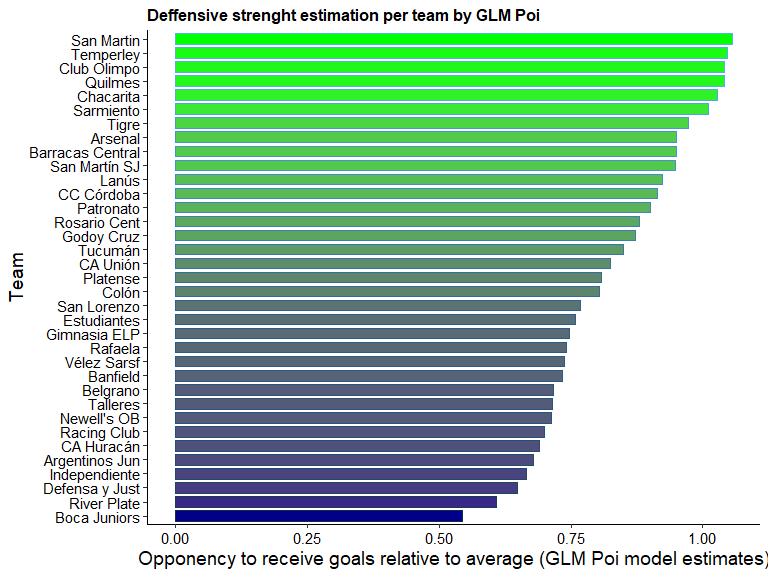
