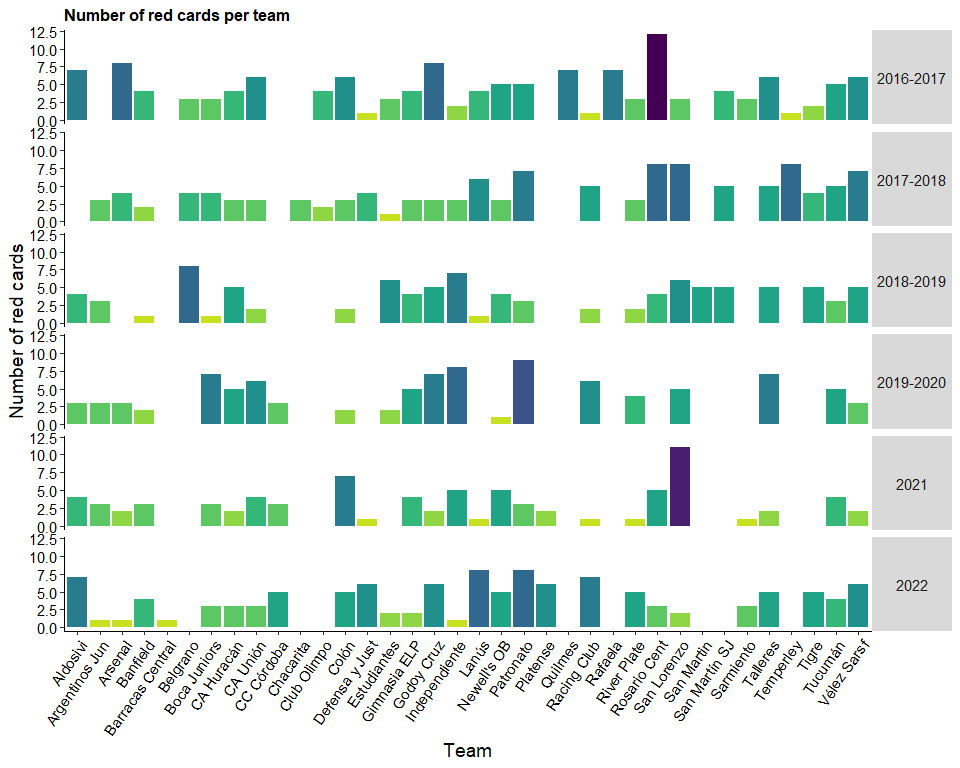
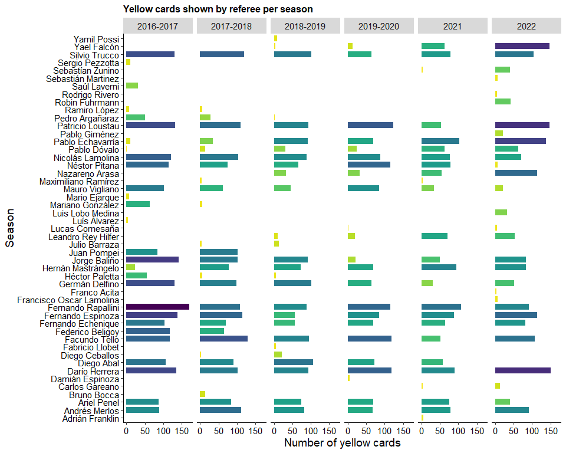
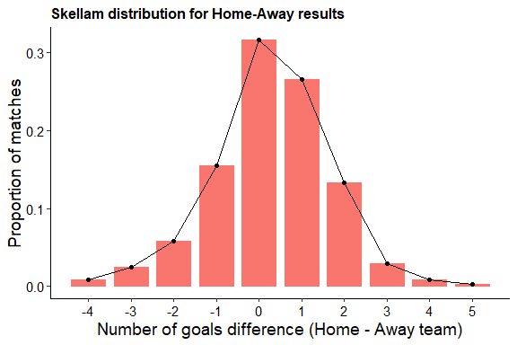

Argentinean League Football Analysis (2016-2022)
================

# **SEASON-WISE ANALYSIS**

Let’s begin our Argentinean league study. The first thing to evaluate is
how many goals were scored per season. We can conclude from this simple
survey that the 2016-17 season had the highest number of goals scored
while the 2019-20 (probably due to the suspension of lots of matches due
to the COVID-19 pandemic) was the poorest one.

## 1.- Total goals per season


## 2.- Goals per season - Home vs Away

Let´s begin with the home effect analysis. The following back-to-back
plot allows a comparison per season of the number of goals scored by the
home and away teams. At a qualitatively level, we can see that the home
team tends to score more goals than the away team. We can easily
perceive there is indeed such an effect, and this type of analysis could
be done match-wise within a season.


## 3.- Heatmap: goals per week of the season

Continuing our league analysis, this heat map shows the number of goals
scored by match week per season. We may get several insights from it.

- The last match week in the last two seasons showed a whooping number
  of goals scored in comparison to the rest of the seasons.
- Because of different formats applied to the Argentinean league, the
  length of the season was never kept constant.
- The 2019-20 season was, definitively, the shortest due to the
  pandemic.


## 4.- Heatmap: goals per match of the season

Next, this heat map shows the average number of goals scored per match,
by match week per season. With these values we can see what is the
expected (I use this term as the average, indistinctly) number of goals
per match.


# **CLUB-WISE ANALYSIS**

## 1.- Goals per team

The following plot depicts the number of goals scored by team and by
season.

- Boca Juniors, Racing Club and River Plate seem to be the teams that
  score the most, throughout the seasons analyzed.
- There are teams missing in some seasons due to relegation (which, as
  the number of matches per season, constantly changed in this league
  during this period)


## 2.- Cards per team

Are there teams that are booked more than others?

- For yellow cards: the most intensive seasons seem to be 2016-17 and
  2022 overall
- For the former, several teams have accumulated a high number of yellow
  cards, while for the latter Boca Juniors seems to have the excessive
  amount fo cards
- For red ones, Rosario Central appears to be the most aggressive one
  during the 2016-17 season while San Lorenzo repeats that trend during
  the 2021.




## 3.- Bonus: Referee’s cards performance

Are there more/less strict referees in terms of bookings? Not all of
them delivered justice in every season, but some of them appear to be
more prone to showing yellow and red cards.




# **PREDICTING RESULTS WITH STATISTICAL MODELLING**

We’re going to use the last season available for the most updated data
(i.e. season 2022).

## 1.- Season development and winner


First, let’s look at the development of the season, whose winner was
Boca Juniors.

Now to perform predictions and recap on our home effect analysis, we’ll
apply the most basic distribution for discrete numbers (in our case,
this will be the number of goals), that is, the Poisson distribution.

Such distribution assumes:

- The probability of an event occurring in a given time interval does
  not vary with time
- The events occur at random
- The events occur independently

This distribution has only one parameter, lambda, which is the average
number events per period of time. In terms of our study case, lambda
will represent the average number of goals scored per 90-min match.

We can directly calculate the average number of goals in the desired
season, so that the home team scores in average 1.2 while the away team
scores 0.91

## 2.- Number of goals per match (observed vs. expected)

The plot below shows the proportion of matches where goals were scored
by the home or the away team (observed, bars), while also showing the
estimated by the corresponding Poisson distributions using the average
goals mentioned before (estimated, lines).

- From the observed distributions, the away team seem to have a much
  higher proportion of matches without scoring any goals, and that
  number is greater than for the home team.
- When scoring one goal, the proportion is similar, while the trend
  shows a much higher proportion of matches where the home team scored 2
  to 5 goals in comparison with the away team.
- The fitted model does not seem to deviate greatly from the actual seen
  numbers.


We can go a step further with the simple Poisson model, estimating the
probability of specific events. For example, what is the probability of
the h ome team scoring 2 or more goals? we’re asking for
$P( \ge 2 | Home)$, which is 0.3391023.

## 3.- Difference goal result: most probable scenarios

What about draws? this is another way of inspecting the home effect. For
this, we need to know when the difference between the home and away team
Poisson distributions is 0. The distribution that results from
subtracting one Poisson from another is called a Skellam distribution.

    ## <ScaleContinuousPosition>
    ##  Range:  
    ##  Limits:    0 --    1



With this plot we can see that for the Argentinean League, the most
probable scenario is a 0-0 draw. Then, there is a higher probability of
the home team winning by one goal and in third place, there is almost
the same probability of the home team winning by two goals and the away
team, winning by one goal.

## 4.- Build a GLM model

Finally, let’s build a GLM model with which we can make some specific
analysis on the participating teams.

Note that if we apply this model to a small sample size (lets say when
the season is going through the 8th match week, where each team in the
entire season would’ve played 27 matches), the accuracy of this
approximation can vary significantly.

|                              | Estimate | Std. Error | z value | Pr(\>\|z\|) |
|:----------------------------:|:--------:|:----------:|:-------:|:-----------:|
|       **(Intercept)**        | -0.1881  |   0.1276   | -1.474  |   0.1404    |
|   **equipoArgentinos Jun**   |  0.304   |   0.1343   |  2.264  |   0.02355   |
|      **equipoArsenal**       |  0.1878  |   0.1366   |  1.375  |   0.1692    |
|      **equipoBanfield**      |  0.2638  |   0.1296   |  2.036  |   0.04171   |
|  **equipoBarracas Central**  |  0.3174  |   0.2146   |  1.479  |   0.1393    |
|      **equipoBelgrano**      | 0.03311  |   0.1605   | 0.2064  |   0.8365    |
|    **equipoBoca Juniors**    |  0.7341  |   0.1197   |  6.133  |  8.649e-10  |
|     **equipoCA Huracán**     |  0.3041  |   0.1286   |  2.364  |   0.01807   |
|      **equipoCA Unión**      |  0.3249  |   0.1282   |  2.535  |   0.01124   |
|     **equipoCC Córdoba**     |  0.4005  |   0.1502   |  2.667  |  0.007649   |
|     **equipoChacarita**      |  0.1248  |   0.2321   | 0.5378  |   0.5907    |
|    **equipoClub Olimpo**     |  0.1785  |   0.1721   |  1.037  |   0.2996    |
|       **equipoColón**        |  0.2223  |   0.1307   |   1.7   |   0.08906   |
|   **equipoDefensa y Just**   |  0.5032  |   0.1241   |  4.054  |  5.032e-05  |
|    **equipoEstudiantes**     |  0.4226  |   0.1259   |  3.356  |  0.0007913  |
|    **equipoGimnasia ELP**    |  0.217   |   0.1309   |  1.658  |   0.09741   |
|     **equipoGodoy Cruz**     |  0.416   |   0.1262   |  3.297  |  0.0009765  |
|   **equipoIndependiente**    |  0.4334  |   0.1259   |  3.442  |  0.0005766  |
|       **equipoLanús**        |  0.411   |   0.1264   |  3.251  |  0.001149   |
|    **equipoNewell’s OB**     |  0.3129  |   0.1283   |  2.438  |   0.01476   |
|     **equipoPatronato**      |  0.2923  |   0.1291   |  2.264  |   0.02355   |
|      **equipoPlatense**      |  0.3955  |   0.1661   |  2.38   |   0.0173    |
|      **equipoQuilmes**       | -0.3063  |   0.2631   | -1.164  |   0.2444    |
|    **equipoRacing Club**     |  0.6475  |   0.1214   |  5.334  |  9.595e-08  |
|      **equipoRafaela**       |  0.2175  |   0.2119   |  1.026  |   0.3047    |
|    **equipoRiver Plate**     |  0.7797  |   0.1191   |  6.549  |  5.806e-11  |
|    **equipoRosario Cent**    |  0.4061  |   0.1264   |  3.212  |  0.001317   |
|    **equipoSan Lorenzo**     |  0.4233  |   0.1259   |  3.362  |  0.0007748  |
|     **equipoSan Martin**     |  0.3063  |   0.2245   |  1.364  |   0.1724    |
|   **equipoSan Martín SJ**    |  0.2447  |   0.1517   |  1.613  |   0.1067    |
|     **equipoSarmiento**      |  0.2297  |   0.1522   |  1.509  |   0.1312    |
|      **equipoTalleres**      |  0.4537  |   0.1252   |  3.624  |  0.0002904  |
|     **equipoTemperley**      |  0.1751  |   0.1721   |  1.017  |   0.3089    |
|       **equipoTigre**        |  0.4992  |   0.1332   |  3.747  |  0.0001788  |
|      **equipoTucumán**       |  0.3552  |   0.1276   |  2.783  |  0.005384   |
|    **equipoVélez Sarsf**     |  0.4243  |   0.126    |  3.366  |  0.0007621  |
|  **oponenteArgentinos Jun**  | -0.3875  |   0.1172   | -3.305  |  0.000949   |
|     **oponenteArsenal**      | -0.05093 |   0.1058   | -0.4813 |   0.6303    |
|     **oponenteBanfield**     | -0.3097  |   0.1081   | -2.865  |  0.004177   |
| **oponenteBarracas Central** | -0.05098 |   0.1824   | -0.2794 |   0.7799    |
|     **oponenteBelgrano**     | -0.3332  |   0.133    | -2.505  |   0.01226   |
|   **oponenteBoca Juniors**   |  -0.61   |   0.1185   |  -5.15  |  2.61e-07   |
|    **oponenteCA Huracán**    | -0.3713  |    0.11    | -3.375  |  0.0007387  |
|     **oponenteCA Unión**     | -0.1916  |   0.1049   | -1.826  |   0.06785   |
|    **oponenteCC Córdoba**    | -0.08974 |   0.1266   | -0.7089 |   0.4784    |
|    **oponenteChacarita**     | 0.02771  |   0.1765   |  0.157  |   0.8753    |
|   **oponenteClub Olimpo**    | 0.04052  |   0.1336   | 0.3032  |   0.7618    |
|      **oponenteColón**       | -0.2176  |   0.1056   | -2.059  |   0.03945   |
|  **oponenteDefensa y Just**  | -0.4345  |   0.1126   | -3.859  |  0.0001138  |
|   **oponenteEstudiantes**    | -0.2758  |   0.1074   | -2.567  |   0.01025   |
|   **oponenteGimnasia ELP**   | -0.2905  |   0.1076   |  -2.7   |  0.006939   |
|    **oponenteGodoy Cruz**    | -0.1378  |   0.1037   | -1.329  |   0.1838    |
|  **oponenteIndependiente**   | -0.4079  |   0.1117   | -3.652  |   0.00026   |
|      **oponenteLanús**       | -0.07877 |   0.1023   | -0.7703 |   0.4411    |
|   **oponenteNewell’s OB**    | -0.3374  |   0.109    | -3.094  |  0.001975   |
|    **oponentePatronato**     | -0.1041  |   0.1027   | -1.014  |   0.3108    |
|     **oponentePlatense**     | -0.2144  |   0.1498   | -1.431  |   0.1524    |
|     **oponenteQuilmes**      | 0.03951  |   0.1697   | 0.2328  |   0.8159    |
|   **oponenteRacing Club**    | -0.3575  |    0.11    | -3.249  |  0.001157   |
|     **oponenteRafaela**      | -0.3001  |   0.1971   | -1.522  |   0.1279    |
|   **oponenteRiver Plate**    | -0.4963  |   0.1145   | -4.333  |  1.472e-05  |
|   **oponenteRosario Cent**   | -0.1282  |   0.1034   |  -1.24  |   0.2148    |
|   **oponenteSan Lorenzo**    | -0.2645  |   0.1071   |  -2.47  |   0.01352   |
|    **oponenteSan Martin**    | 0.05511  |   0.1804   | 0.3055  |    0.76     |
|  **oponenteSan Martín SJ**   | -0.05336 |   0.1219   | -0.4379 |   0.6615    |
|    **oponenteSarmiento**     |  0.0103  |   0.1191   | 0.08653 |    0.931    |
|     **oponenteTalleres**     | -0.3354  |   0.1092   |  -3.07  |  0.002143   |
|    **oponenteTemperley**     | 0.04618  |   0.1337   | 0.3455  |   0.7297    |
|      **oponenteTigre**       | -0.02758 |   0.1111   | -0.2483 |   0.8039    |
|     **oponenteTucumán**      | -0.1626  |   0.1045   | -1.557  |   0.1196    |
|   **oponenteVélez Sarsf**    | -0.3045  |   0.1083   | -2.811  |   0.00494   |
|         **localia**          |  0.2534  |  0.02938   |  8.623  |  6.504e-18  |

(Dispersion parameter for poisson family taken to be 1 )

|                    |                                 |
|:------------------:|:-------------------------------:|
|   Null deviance:   | 5117 on 4257 degrees of freedom |
| Residual deviance: | 4768 on 4186 degrees of freedom |

When scannig the model’s results, bear in mind that these are displayed
in the *log* scale, so we have to calculate $e ^ {estimate_i}$.

Does the home factor weights? *yes!* since, $e^{0.25} = 1.28$.

Then we can analyze the performance of each team, using the “equipo”
values of the model. Positive values mean that the team scores more than
average and negative, the opposite. For example:

- For River Plate: $e^{0.78} = 2.18$ \[River Plate scores 2.18 goals
  more than the average team\]
- For Quilmes: $e^{-0.3} = 0.74$ \[Quilmes scores 0.74 goals than the
  average team\]

Finally, the “oponente” values rewards teams based on the quality of
their opposition. This mimics the defensive strength of each team”

- For San Lorenzo, $e^{-0.26} = 0.77$
- For River plate, $e^{-0.5} = 0.61$

In other words, if you’re playing against these teams, you’re less
likely to score against River Plate than San Lorenzo.

If we plot the “equipo” and the “oponente” estimates per team,
separately, we can get a peek of which team has the most probability of
score above/below average, and which is the most/least defensive (in
terms of average goals received).

#### 4a. Attacking strenght estimated by the model:

Given the model’s estimates, the largest estimate for the offensive
power is for River Plate.

``` r
POTENCIAL.GOLES
```


#### 4b. Deffensive strenght estimated by the model:

Given the model’s estimates, the largest estimate for the defensive
power is for Boca Juniors.


